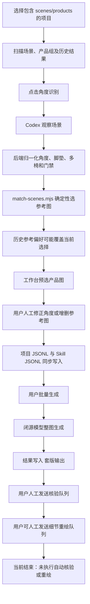
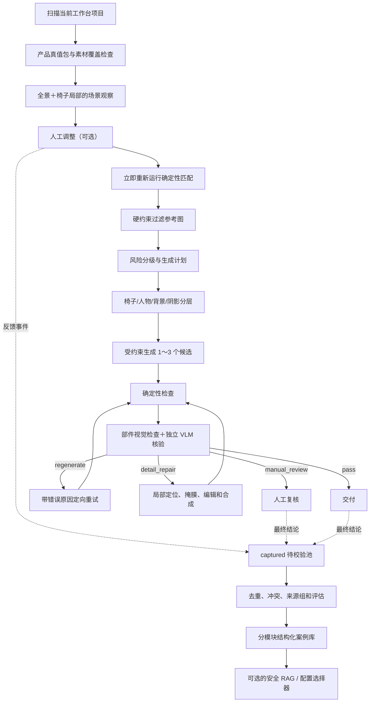
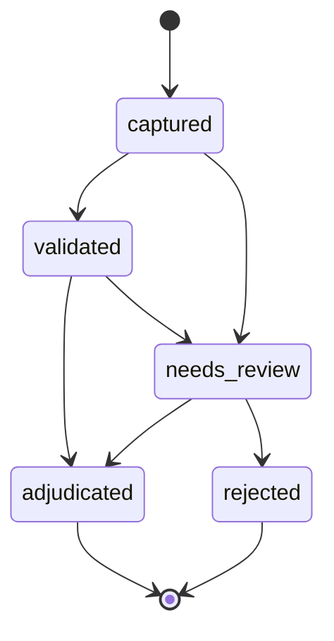

# SceneColor 完整项目 PRD：闭源模型下的套版准确率闭环

| 项目 | 内容 |
| --- | --- |
| 文档版本 | v1.0 |
| 编写日期 | 2026-07-23 |
| 代码基线 | `agent/scene-training-workflow` / `79cc1d1` |
| 产品状态 | 本地单用户工作台；角度识别、参考匹配和图片生成已运行，核验与细节重绘尚未接入执行 API |
| 目标读者 | 产品负责人、开发者、数据/Skill 维护者，以及用于复核方案的其他大模型 |
| 事实口径 | 以当前代码真实调用链为准；仅有页面、Skill 文档或脚本但未接入后端执行的能力，统一标为“未运行” |

> 本文是自包含的项目说明和需求文档。其他大模型无需读取此前对话，也可以据此分析当前系统、比较替代方案并提出改进建议。

## 阅读导航

- 第 0～5 节：结论、背景、目标、用户、项目内容和状态矩阵；
- 第一部分（第 6～7 节）：当前解决方案 AS-IS；
- 第二部分（第 8～10 节）：建议解决方案 TO-BE；
- 第 11 节：当前方案与建议方案逐项对比；
- 第 12～14 节：功能需求、数据模型和建议 API；
- 第 15～19 节：评估、非功能需求、路线、风险和完成标准；
- 第 20～23 节：待确认问题、其他模型复核问题、当前决策和代码证据。

---

## 0. 一页结论

SceneColor 是一个本地椅子图片套版工作台。它扫描 `scenes/` 场景图和 `products/` 产品素材，通过 Codex 识别场景中的椅子角度、脚垫和多椅状态，再用确定性规则选择参考产品图，最后调用 Nano Banana 2 或 GPT Image 2 生成套版结果。

当前最成熟的是“角度观察与参考图匹配”。基于代码链路和尚未接通的模块，本 PRD 将“生成约束与生成后质量控制”列为当前最高优先级假设；它是否确实是最大瓶颈，仍需用冻结端到端基线验证：

1. 当前生成主要依赖整图提示词，没有椅子蒙版、人物保护层、背景像素保护或受控合成。
2. `chair-result-verifier` 和 `chair-detail-restorer` 已有规则、Schema、脚本和页面，但没有实际执行 API。
3. 人工修改角度后，当前参考图不会立即重新匹配，可能继续使用修改前的选择。
4. 单次人工修改会直接进入项目库和 Skill 库，并立即标记为可检索真值，存在误操作污染。
5. 当前所谓“训练”主要是规则、案例记忆和最多 4 条少样本提示，不是闭源模型权重微调，也不是真正的向量 RAG。
6. 当前训练报告主要统计案例数量，没有一套冻结盲测证明系统是否真的变准。

本 PRD 推荐的目标不是“建设一个大 RAG”，而是建设闭源模型外部的准确率控制系统：

```text
产品真值包
→ 场景观察和分层
→ 硬约束参考选择
→ 风险分级生成计划
→ 受约束生成 1～3 个候选
→ 确定性检查＋独立视觉核验
→ 直接通过 / 定向重试 / 局部修复 / 人工复核
→ 人工结果回写
→ 评估通过后才晋升为可检索案例
```

用户端保持最简单的工作流：

```text
点击角度识别
→ 观察和判断
→ 必要时人工调整
→ 当前参考图立即刷新
→ 继续套版
```

所有保存、校验、案例治理和评估都在后台完成，不要求用户离开工作台或理解 RAG、Embedding、数据分区等概念。

---

## 1. 背景与问题定义

### 1.1 业务问题

套版任务不是简单的图片美化，而是把指定椅子的颜色、材质和产品结构准确迁移到原场景，同时保持：

- 原椅子的角度、位置、尺度和透视；
- 人物姿态、肢体和遮挡关系；
- 背景、前景家具、构图和画幅；
- 光照、接触阴影、反射和落地关系；
- 扶手、靠背、坐垫、底座、滚轮、头枕、腰枕、脚垫等产品结构；
- Logo、缝线、包边、纹理、五金等细节。

闭源图像生成模型具有随机性。即使角度和参考图完全正确，仍可能出现错款、旧底座残留、轮子变形、人物融合、背景改变、Logo 丢失等问题。因此，最终准确率不能只靠“更长的提示词”“更多 Skill 文本”或“更多 RAG 案例”解决。

### 1.2 用户明确要求的工作方式

主要操作人员只希望完成正常业务动作：

1. 选择套版项目。
2. 点击角度识别。
3. 观察模型结果。
4. 必要时人工修正角度或参考图；脚垫和多椅实例编辑可作为后续工作台增强。
5. 修改立即用于当前套版。
6. 反馈在后台自动沉淀。
7. 用户继续处理下一张图，不被训练流程阻塞。

用户不应被要求：

- 在训练页重新输入文件夹路径；
- 在训练页再次调用角度识别；
- 手动理解“项目数据库”和“Skill 案例库”的区别；
- 为每次修正选择发布目标；
- 等待后台训练或评估完成后才能继续套版；
- 手工维护一个独立的大型训练模块。

### 1.3 核心概念

| 名称 | 在本项目中的准确含义 |
| --- | --- |
| Skill | 操作规程、规则、输出契约、脚本和少量案例；不等于模型权重训练 |
| 人工反馈 | 用户对角度、脚垫、参考图、生成结果或修复结果的最终判断 |
| 案例库 | JSON/JSONL 或后续数据库中保存的结构化历史记录 |
| 少样本提示 | 在当前模型调用中附带少量人工案例；当前最多使用最近 4 条 |
| 结构化检索 | 先按 Skill、任务、产品、状态等字段过滤，再对候选打分 |
| 向量 RAG | 用图像/文本向量召回相似案例，再注入模型上下文 |
| 真正微调 | 修改模型权重；当前闭源图片生成链路没有接入此能力 |
| 产品真值包 | 每个 SKU 的结构、颜色、部件、镜像规则、多角度和特写素材事实 |
| 受控生成 | 通过掩膜、分层、参考约束、候选优选和核验限制闭源模型随机性 |

---

## 2. 产品目标与非目标

### 2.1 产品目标

1. 提升最终套版结果的人工验收通过率，而不只提升角度识别率。
2. 降低错 SKU、错结构、错脚垫、旧底座/轮子残留、人物破坏和背景改变等危险错误。
3. 让人工修改立即作用于当前任务，同时在后台安全沉淀。
4. 对低风险任务保持高效率，对高风险任务自动增加候选、核验或人工门禁。
5. 让每张结果都能追溯到场景、产品素材、模型、Prompt、Skill、Policy、候选、核验和人工结论。
6. 用冻结验证集、盲测集和回归集证明每次改动是否真的提高准确率。
7. 保持本地优先、单机可运行，不强制引入复杂云端数据库或微服务。
8. 为后续结构化检索、向量 RAG、模型路由和高频 SKU 3D 资产预留清晰边界。

### 2.2 非目标

1. 不以修改闭源模型权重为前提。
2. 不把“案例数量增长”当作准确率提升证明。
3. 不建设三个 Skill 共用的无隔离扁平 RAG 池。
4. 不允许相似度覆盖 SKU、方向、脚垫、镜像等硬事实。
5. 不通过无限重试或无上限堆叠参考图换取偶然成功。
6. 不用一个综合平均分掩盖错产品、人物破坏等关键失败。
7. 不要求主要用户成为数据管理员。
8. 当前阶段不建设多租户、账号权限、云端协作或大型分布式任务系统。

---

## 3. 用户与使用场景

| 用户角色 | 核心能力 | 核心诉求 |
| --- | --- | --- |
| 套版操作人员 | 熟悉产品和业务图，能判断角度、脚垫、参考图和成图质量 | 少点击、修改立即生效、系统越来越少犯同类错误 |
| 质量复核人员 | 判断通过、重生成、局部修复或人工处理 | 重大错误不能被自动放行，证据和路由清晰 |
| Skill/数据维护者 | 维护规则、案例、评估集和版本 | 能看真实指标、数据来源、污染风险和发布门禁 |
| 开发维护者 | 维护本地前后端、模型适配器和脚本 | 模块边界清晰、可回归、可替换供应商 |

重点业务场景：

- 单椅完整可见、仅换色或材质；
- 单椅斜角、侧面、背面；
- 人物坐在椅子上或遮挡扶手、坐垫；
- 桌子、手臂、衣物等前景遮挡；
- 局部裁切、远景小椅子、半椅特写；
- 多椅同型号和多椅不同型号；
- 脚垫伸出、收起、部分伸出、完全不可见或产品无脚垫；
- 左右非对称、Logo 不允许镜像；
- 素材角度缺失或关键部件没有可信参考；
- 生成后只有 Logo、缝线、包边、纹理、五金等局部缺陷。

---

## 4. 当前工作区与项目内容总览

### 4.1 工作区交付资产

工作区根目录包含：

- `SceneColor-应用-20260716/`：当前活动代码和本地样例项目；
- `Chair-Angle-Skill-训练项目-20260716.zip`：历史完整训练资产包；
- `SceneColor-应用-20260716-e71fa5c284c5.zip`：历史应用快照；
- `SHA256SUMS-77bd262afbc0.txt`：交付包校验；
- `项目交接说明-20260716-38bc1fa1393b.md`：原始交接和历史训练成果说明。

历史交接材料记录了 19 张回归场景、B6 新图测试和更大的产品素材包。本文对“当前运行能力”的判断以活动代码为准，不把历史压缩包中的能力自动视为已经接入当前页面。

### 4.2 技术栈

| 层级 | 技术 |
| --- | --- |
| 前端 | React 18、TypeScript、Vite |
| UI/动效 | GSAP、Phosphor Icons、TanStack Virtual |
| 后端 | Node.js、Express |
| 图片处理 | Sharp |
| Agent 观察 | Codex CLI 后台进程 |
| 兼容 Agent 接口 | MCP Server |
| 图片生成 | Comfly 兼容接口；Nano Banana 2 或 GPT Image 2 |
| 当前存储 | 项目内 JSON/JSONL、浏览器 `localStorage`、少量内存缓存 |
| 当前数据库 | 无关系型数据库、无向量数据库、无独立 RAG 服务 |
| 自动测试 | 15 个测试文件、37 个测试用例；主要验证代码规则，不代表视觉盲测准确率 |

### 4.3 主要代码目录

| 路径 | 当前职责 |
| --- | --- |
| `src/App.tsx` | 四个页面模式、运行时、API Key、核验/重绘队列 |
| `src/components/FolderMode.tsx` | 套版主工作台，当前功能最完整 |
| `src/components/SkillTraining.tsx` | 训练汇报、批量复核、重新匹配和案例发布 |
| `src/components/VerificationWorkbench.tsx` | 核验队列 UI；执行尚未接入 |
| `src/components/DetailRedrawWorkbench.tsx` | 细节修复配置 UI；执行尚未接入 |
| `src/components/RuntimeControlPanel.tsx` | Codex Provider、模型、推理强度和 Skill 绑定展示 |
| `src/components/SettingsModal.tsx` | 两组图片模型 API Key |
| `src/api/client.ts` | 前端 HTTP API 封装 |
| `src/types/index.ts` | 角度、生成、训练、核验、修复和进度类型 |
| `src/lib/workflowStorage.ts` | 核验、重绘队列的浏览器持久化 |
| `src/lib/workflowProgress.ts` | 三阶段进度状态 |
| `server/routes/api.ts` | HTTP API、图片生成调用、结果保存 |
| `server/lib/codexSkillRecognition.ts` | 当前 Codex 角度识别编排 |
| `server/lib/chairAnglePolicy.ts` | 角度策略与方位角归一化 |
| `server/lib/skillResults.ts` | Skill 结果和历史参考偏好读取 |
| `server/lib/skillTrainingWorkflow.ts` | 人工复核、案例写入和训练报告 |
| `server/lib/chairCaseRetriever.ts` | 安全结构化检索器；当前只在测试中使用 |
| `server/lib/prompt.ts` | 当前整图生成提示词 |
| `server/lib/angleAnalyzer.ts` 等 | 旧版 Comfly 场景/产品角度兼容链路 |
| `server/mcp.ts` | 旧版角度 Agent 的 10 个 MCP 工具 |
| `skills/chair-angle-matcher/` | 已运行的角度观察与参考匹配 Skill 资产 |
| `skills/chair-result-verifier/` | 核验规则、Schema 和校验脚本；未运行 |
| `skills/chair-detail-restorer/` | 局部修复规则和确定性脚本；未运行 |

当前没有 React Router。四个页面由 `App.tsx` 同时挂载，通过 `mode + hidden` 切换。

README 中仍存在“单图换色页面”等历史描述，但当前 `Header/App` 实际只暴露：

1. 套版工作台；
2. 生成核验；
3. 细节重绘；
4. Skill 训练。

### 4.4 当前随仓库样例项目

| 项目 | 场景 | 产品图 | 产品组 | 当前训练报告 |
| --- | ---: | ---: | ---: | --- |
| `DOWINX-P1-LS-66D57H` | 4 | 9 | 3：black/gray/tan | 12 组匹配；3 auto、9 unmatched |
| `DOWINX-P1-QL-66B7` | 7 | 197 | 5：灰/白/粉/蓝/黑 | 35 组匹配；15 auto、5 review、15 unmatched |

两份报告中的 100% 指标是“保存标签经过 evaluator 往返没有漂移”的 self-consistency，并非独立盲测准确率。报告自身已经包含这一警告。

当前角度 Skill 资产还包括：

- 19 条 `calibration-cases.json` 校准案例；
- 11 条第一优先案例清单：QL 7 条、LS 4 条；
- 12 条生成困难负例描述；
- 7 个产品组、8 条产品锚点记录的内置索引；这些锚点覆盖 front、front_right、right、left、front_left 5 个唯一语义方向，以及收起/伸出等状态组合；
- 12 条核验路由文字案例。

仓库基线中 `training-cases.jsonl` 和 `reference-training-cases.jsonl` 可能尚不存在；它们会在首次有效运行时反馈后创建。实际可用案例规模必须从运行时语料、审核状态和质量报告读取，不能用文件路径存在与否推断。

---

## 5. 当前模块状态矩阵

状态定义：

- **已运行**：前端按钮、后端 API 和真实执行链已经连通；
- **部分运行**：只实现了部分数据或页面流转；
- **资产就绪**：Skill、Schema 或脚本存在，但应用未调用；
- **未实现**：当前代码没有对应能力。

| 模块 | 状态 | 当前能力 | 主要缺口 |
| --- | --- | --- | --- |
| 项目扫描 | 已运行 | 扫描 `scenes/`、`products/` 和一层产品组 | 没有正式 SKU/材质/部件元数据 |
| Codex 运行时 | 已运行 | 检查 CLI、登录、Provider、模型、推理强度和 Skill | 后两项 Skill 只显示绑定，不执行 |
| 场景角度识别 | 已运行 | 角度、方位角、可观测性、遮挡、脚垫、多椅 | 小目标没有专门高清裁切；置信度未做真实校准 |
| 确定性参考匹配 | 已运行 | 角度、方向、脚垫、镜像、多视图和拒绝门禁 | 素材索引覆盖有限；当前人工修正后不立即重跑 |
| 工作台人工角度反馈 | 已运行 | 当前角度更新，写项目库和 Skill 库 | 一次修正立即成为全局真值；参考匹配仍可能是旧结果 |
| 参考图反馈 | 已运行 | 保存最终选中和被拒候选 | 跨图回放条件只有角度、场景模式和脚垫，缺少 SKU/相似度/审核门禁 |
| 结构化案例检索 | 资产就绪 | 检索器和测试已存在 | 主识别链未调用；当前仍取最近 4 条 |
| 向量 RAG | 未实现 | 无 | 无 Embedding、向量库、namespace、reranker 和检索评估 |
| 图片生成 | 已运行 | 场景＋主参考＋最多两张辅助图；批量、重试、版本、缓存 | 整图提示词约束；无蒙版、分层、候选优选、自动验收 |
| 核验队列 | 部分运行 | 人工发送、展示输入关系、人工转重绘 | 无核验 API、verdict、自动路由 |
| 结果核验 Skill | 资产就绪 | 错误分类、路由、Schema、校验脚本 | 后端未读取或执行 |
| 细节重绘队列 | 部分运行 | 人工选择 Logo/缝线/包边/纹理/五金目标 | 无区域定位和图片编辑调用 |
| 细节修复 Skill | 资产就绪 | 索引、裁切、掩膜、合成、像素保护脚本 | 无后端编排和编辑 API |
| 训练汇报 | 部分运行 | 数量、活动时间、角度分布 | 没有真实准确率、危险错误、版本对照或盲测 |
| 旧版角度 API/MCP | 已运行但兼容 | 场景/产品逐图分析和本地匹配 | 与当前 Codex + Skill 主链路并存，存在认知负担 |
| 持久任务系统 | 未实现 | 前端进度对象和 localStorage 队列 | 无后台持久任务、断点续跑和服务重启恢复 |

---

# 第一部分：当前解决方案（AS-IS，独立说明）

## 6. 当前解决方案总流程



## 7. 当前方案分项说明

### 7.1 项目扫描

项目目录约定：

```text
项目目录/
  scenes/
    001.jpg
    002.png
  products/
    白色/
      chair-a.jpg
    黑色/
      chair-a.jpg
```

当前规则：

- `scenes/` 只扫描第一层；
- `products/` 支持第一层图片，或一层子目录作为产品组；
- 不递归更深层目录；
- 支持 jpg、jpeg、png、webp、bmp；
- 产品子目录名称直接成为 `groupName`；
- 扫描后项目根目录会注册到路径白名单，后续图片只能从该项目内部读取；
- 没有独立 SKU、产品型号、颜色、材质和部件 Manifest。

### 7.2 Codex + `chair-angle-matcher`

当前主角度流程由 TypeScript 编排，不是让 Codex 自由执行完整 `SKILL.md`：

1. 读取 `recognition-contract.md`；
2. 读取 `decision-policy.json`；
3. 读取项目本地或内置 `product-angle-index.json`；
4. 场景图最长边缩放到 1024，JPEG 质量 82；
5. 默认每次 Codex 调用最多 8 张场景，可配置但最多 24 张；单项目最多 240 张；
6. 正常生产路径加载最多最近 4 条人工修正案例作为 guidance；
7. Codex 返回结构化观察；
8. 后端根据 Policy 归一化语义角度和安全状态；
9. 调用 `match-scenes.mjs` 完成确定性产品锚点选择。

当前决策策略包含：

- 正面：`[350°,360°) ∪ [0°,10°]`；
- 右前：`(10°,80°)`；
- 右侧：`[80°,100°]`；
- 右后：`(100°,170°)`；
- 背面：`[170°,190°]`；
- 左后：`(190°,260°)`；
- 左侧：`[260°,280°]`；
- 左前：`(280°,350°)`；
- 自动角度置信度下限 0.85；
- 最大遮挡 0.65；
- 脚垫置信度下限 0.85；
- 可见脚垫下限 0.5；
- 多视图场景默认进入 review。

输出包括：

- 八方向、multiple 或 unknown；
- 连续方位角；
- `exact / coarse / none` 可观测性；
- 左/右/中画面朝向；
- 遮挡、可见部件、椅子数量；
- 单椅、多椅同款、多椅混款；
- 脚垫能力、伸缩状态、可见度和置信度；
- `auto / review / unmatched`；
- 主参考、辅助参考和镜像状态。

### 7.3 当前人工角度反馈

用户可以在主工作台直接调整：

- 可观测性；
- 语义角度和连续方位角；
- 粗方向；
- 修改说明。

主工作台当前不能直接编辑脚垫能力/状态或多椅实例角度；这些字段只在 Skill 训练页的旧批量复核流程中提供。

保存后当前页面角度立即更新，并写入：

```text
项目/.scenecolor/skill-training/inline-reviews/
项目/.scenecolor/skill-training/inline-overrides.json
项目/.scenecolor/case-corpus/cases.jsonl
应用/skills/chair-angle-matcher/references/training-cases.jsonl
```

当前实现会把单次修正直接设为：

```text
split = retrieval
annotationStatus = adjudicated
retrievalEligible = true
confidence = 1（调整结果）
```

重要缺口：保存后只更新 `skillScenes` 和 `sceneAngles`，没有重新执行当前场景的确定性参考匹配，所以参考图可能仍是修改前结果。

### 7.4 当前参考图反馈

用户增删参考图后，前端延迟约 600ms 保存：

- 系统建议产品；
- 用户最终选择产品；
- 用户删除的建议产品；
- 当前观察角度、场景模式、脚垫等；
- 场景和产品图片哈希。

这里的“系统建议产品”当前只包含各 match 的主 `productPath`，不包含 `supportingReferences` 辅助参考。

数据同时写入项目库和 Skill 库。

当前跨图历史回放逻辑：

- 同一图片哈希：优先级最高；
- 非同图：只要角度、场景模式、脚垫状态三个字段相等，就可能采用历史完整选择；
- 没有 SKU、颜色、裁切、遮挡、可见部件、来源组、审核状态或视觉相似度门槛；
- 历史选择可以整体覆盖确定性匹配结果。

### 7.5 当前“训练”和检索

当前已经实现：

- 同图人工覆盖；
- 人工角度案例 JSONL；
- 最近最多 4 条案例少样本提示；
- 参考图正负反馈记录；
- 三字段参考偏好回放；
- 一个具备 split、审核状态、Policy 过滤和来源组去重能力的结构化检索器。

当前没有实现：

- 主链路调用安全结构化检索器；
- 图像 Embedding；
- 向量数据库；
- 按 Skill/任务隔离的 namespace；
- 相似图片召回；
- reranker；
- 检索 Precision/Recall；
- 在线或离线闭源模型权重微调。

因此，当前不是 RAG 系统；它是“确定性规则＋最近案例少样本＋规则式历史回放”。

### 7.6 当前图片生成

生成输入：

- 原场景图；
- 1 张主产品参考；
- 最多 2 张辅助产品参考；
- 基础提示词；
- 可选全局或单场景附加提示词；
- 模型、分辨率、画幅比例、版本号。

支持：

- `nano-banana-2`；
- `gpt-image-2`；
- 1K、2K、4K；
- `auto` 或常见固定画幅；
- 多 API Key 并发；
- 停止、失败重试、附加提示重新生成；
- 结果版本 `v2...v999`；
- 最多 6 个结果、30 分钟的进程内去重缓存；
- 结果保存到 `套版输出/<产品组名或无分组产品文件名>-<场景名>[-vN].png`。

当前生成控制仅存在于提示词：

- 要求保持背景、人物、构图不变；
- 要求复制产品颜色、材质和结构；
- 要求保持原角度、透视、光照和阴影；
- 多椅场景要求保留各实例角度。

代码没有：

- 椅子检测框或掩膜；
- 人物/前景保护层；
- 深度、关键点或相机姿态；
- 编辑区域硬限制；
- 多候选生成和排序；
- 生成后像素比较；
- 自动质量验收；
- 错误驱动重试策略。

### 7.7 当前核验方案

`chair-result-verifier` 已定义：

- 产品身份、颜色、结构、人物、场景、透视、物理合理性等错误分类；
- `pass / detail_repair / regenerate / manual_review` 路由；
- JSON Schema；
- 归一化问题区域；
- verdict 校验脚本；
- 12 条文字边界案例。

当前实际应用只做到：

- 用户从套版结果手工发送核验任务；
- 浏览器队列记录场景、产品、辅助参考、版本和路径；
- 页面展示生成图、产品图和核验标准；
- 用户可以直接人工发送到细节重绘。

当前不存在核验 API，后端也没有读取核验 Skill、Schema 或执行校验脚本。

### 7.8 当前细节修复方案

`chair-detail-restorer` 已定义：

- Logo、缝线、包边、纹理、五金、局部颜色等允许目标；
- 产品素材 Manifest；
- 归一化区域计划；
- 裁切、掩膜、原坐标合成；
- 掩膜外像素保护；
- 最多两次重试；
- 错产品、人物、背景和大结构不得局部修复。

已存在 Python 脚本：

- `index-product-assets.py`；
- `validate-region-plan.py`；
- `crop-region.py`；
- `build-mask.py`；
- `composite-region.py`；
- `validate-composite.py`。

当前页面只允许人工选择修复目标并展示计划流程。后端没有定位 Agent、图片编辑调用或脚本编排。

### 7.9 当前 Skill 训练页面

当前“查看训练汇报”：

- 自动读取工作台保存的项目路径；
- 不要求用户再次输入文件夹；
- 不重新调用角度识别模型；
- 读取当前识别、人工修正和参考图反馈；
- 展示项目案例数、Skill 案例数、修正数、偏好数和角度分布。

页面仍保留旧的高级管理流程：

1. 逐图确认或修改全部标签；
2. 全部审核后重新计算；
3. 生成 review run；
4. 选择发布到项目案例库或 Skill 案例库。

这套旧流程对数据维护者有用，但不应继续作为普通用户的主训练流程。

### 7.10 当前 HTTP API

| API | 当前作用 | 状态 |
| --- | --- | --- |
| `POST /api/scan-folder` | 扫描项目及历史结果 | 已运行 |
| `POST /api/thumbnail` | 读取缩略图 | 已运行 |
| `GET /api/ai-runtime/status` | Codex/Provider/模型/Skill 状态 | 已运行 |
| `POST /api/recognize-angles-with-skill` | Codex 观察＋确定性匹配 | 已运行 |
| `POST /api/load-skill-results` | 读取当前 Skill 产物 | 已运行 |
| `POST /api/save-inline-skill-training` | 保存单图人工角度修正 | 已运行 |
| `POST /api/save-reference-training` | 保存参考图正负反馈 | 已运行 |
| `POST /api/skill-training-report` | 返回数量和角度分布 | 已运行 |
| `POST /api/recalculate-skill-training` | 完整人工复核后重新匹配 | 已运行 |
| `POST /api/publish-skill-training` | 发布完整复核案例 | 已运行 |
| `POST /api/analyze-scene-angles` | 旧版场景角度识别 | 兼容路径 |
| `POST /api/scene-angles` | 旧版场景角度读取 | 兼容路径 |
| `POST /api/analyze-product-angles` | 旧版产品角度识别 | 兼容路径 |
| `POST /api/product-angles` | 旧版产品角度读取 | 兼容路径 |
| `POST /api/auto-match-angles` | 旧版角度匹配 | 兼容路径 |
| `POST /api/generate` | 图片生成和本地保存 | 已运行 |

当前明确不存在：

- 核验执行 API；
- 自动路由 API；
- 局部重绘 API；
- 区域规划 API；
- RAG/Embedding/向量库 API；
- 生成计划和候选优选 API；
- 后台持久任务查询 API。

### 7.11 当前数据存储

项目内主要数据：

```text
.scenecolor/
  scene-angles.json                 # 旧版
  product-angles.json               # 旧版
  angle-matches.json                # 旧版

  skill-training/
    product-angle-index.json
    current-run.json
    scene-angle-results.json
    footrest-matching-results.json
    recognition-cache.json
    runs/
      codex-<runId>/
      review-<reviewId>/
    reviews/
    inline-reviews/
    inline-overrides.json
    reference-feedback/

  case-corpus/
    cases.jsonl
    reference-cases.jsonl
```

浏览器 `localStorage` 保存：

- 当前页面；
- 当前项目路径；
- Codex 运行时选择；
- 图片模型、分辨率和比例；
- 两组图片模型 API Key；
- 核验队列；
- 细节重绘队列。

队列持久化时会移除 base64 图片，只保留路径和元数据；页面刷新后图片字段必为空，当前也没有按路径自动重新载入，因此核验预览和继续发送细节重绘会受阻，需要从套版工作台重新发送任务。API Key 当前以明文 JSON 保存在浏览器本地存储。

### 7.12 当前方案的优点

1. 本地优先，部署和数据边界简单。
2. 观察与确定性匹配已经分离。
3. 角度、方向、脚垫、多椅和镜像有明确安全规则。
4. 支持主动拒绝，未强迫所有场景自动匹配。
5. 人工反馈已经进入日常工作台，不再完全依赖独立训练模块。
6. 项目产物、图片哈希、Policy 和 run 结构为后续可追溯性打下基础。
7. 核验与细节修复的 Skill 规则和确定性脚本已经提前准备。
8. 生成支持多个模型、分辨率、比例、版本和并发。

### 7.13 当前方案的关键问题

按最终准确率影响排序：

#### P0：直接影响本次业务结果

1. 人工修正角度后，没有立即重新运行参考匹配。
2. `review` 结果仍会被自动预选；当前映射逻辑只排除 `unmatched`。
3. 整图生成只有软提示约束，无法强制保护人物和背景。
4. 核验 Skill 没有执行，生成错误无法自动拦截。
5. 细节修复没有执行，Logo、缝线等只能依赖重新生成或人工处理。

#### P1：可能让“学习”反向降低准确率

6. 主识别调用最近 4 条修正，不按当前图片相关性检索。
7. 单次修正同时写项目库和 Skill 库，立即成为全局可检索真值。
8. 参考偏好跨图回放条件过粗，并可覆盖确定性结果。
9. 没有 captured、validated、adjudicated 的案例晋升过程。
10. 没有盲测模式，评估图片可能被历史覆盖或自动写回。

#### P2：限制泛化与可证明性

11. 小椅子只看缩放全景，没有全景＋高清局部双输入。
12. 产品组只是文件夹名，没有 SKU 真值和部件素材覆盖矩阵。
13. 当前报告是数量和 self-consistency，不是端到端真实准确率。
14. 核验只有文字规则案例，没有真实生成图像对。
15. 没有统一记录模型版本、Prompt、参考组合、候选、成本和最终人工结论。
16. 闭源模型版本变化时缺少自动回归和发布门禁。

---

# 第二部分：建议解决方案（TO-BE，独立说明）

## 8. 建议方案总原则

闭源模型只负责它擅长的部分：

- 视觉观察；
- 图片生成/编辑；
- 语义核验；
- 局部区域定位建议。

系统代码负责最终控制：

- SKU、角度、脚垫、镜像等硬约束；
- 数据审核和检索隔离；
- 掩膜、坐标、裁切、合成；
- 候选数量和成本上限；
- 核验路由；
- 重试次数；
- 像素保护；
- 评估、版本和发布门禁。

Skill 负责规则和契约，案例库负责事实，RAG 负责按需找少量历史证据。任何单一模型、单一评分或单一 RAG 都不拥有最终决策权。

## 9. 目标方案总流程



## 10. 建议方案分项

### 10.1 人工调整：当前立即生效，泛化后台晋升

一次人工修改拆成两种作用：

1. **当前任务作用**
   - 立即更新当前观察；
   - 立即运行本地 matcher；
   - 刷新主参考和辅助参考；
   - 同一图片哈希永久记住；
   - 用户继续套版，不等待后台。

2. **跨任务泛化**
   - 先保存为 `captured`；
   - 后台检查图片、Hash、Schema、重复、冲突、来源组和 Policy；
   - 合格后进入 `validated`；
   - 需要复核的进入 `needs_review`；
   - 只有正式审核或满足明确晋升策略后才成为 `adjudicated + retrievalEligible`；
   - 不因一次误点立即污染全局 Skill。

用户看到的状态应是：

- 保存中；
- 已对当前任务生效；
- 已记录，待后台校验；
- 保存失败，等待重试。

不要向用户显示“模型已经训练完成”这类不准确表述。

### 10.2 产品真值包

为每个 SKU 或产品组建立机器可读真值：

```text
productId / sku / productFamily / colorway
主颜色、材质、颜色分区
扶手、靠背、坐垫、头枕、腰枕
底座、脚轮、支撑硬件
脚垫能力与可用状态
Logo 位置、方向和清晰参考
左右是否对称
是否允许镜像
可用角度与连续方位角
全景图、角度图、部件特写
图片哈希、素材质量和审核状态
```

允许自动生成的最小必填事实：

| 类型 | 最小必填内容 | 缺失时动作 |
| --- | --- | --- |
| 身份 | `productId`、产品族、颜色组、Manifest 版本 | 阻止自动生成 |
| 大结构 | 靠背、坐垫、扶手、底座/脚轮；存在时包含头枕、腰枕、脚垫 | 关键区分部件缺失时进入人工复核 |
| 状态 | 脚垫能力；适用时包含伸出/收起状态 | 与场景冲突时阻止 |
| 几何 | 每张全景参考的方位角、方向、镜像许可 | 无兼容视图时阻止或补素材 |
| 证据 | 至少一张已审核整椅参考；每个身份区分部件有可读证据 | 不允许模型自行补全 |
| 治理 | `annotationStatus=adjudicated`、审核人/时间、图片 Hash | draft 事实只能提示人工，不能作为硬门禁 |

自动索引、文件名推断或 VLM 提取只能生成 draft ProductTruthPack。用于错 SKU、错结构和镜像一票否决的事实必须经过人工确认或其他明确的审核流程。

生成素材覆盖矩阵，明确“哪些事实有证据、哪些没有证据”。硬门禁：

- SKU 或颜色组不一致时禁止自动选用；
- 脚垫状态冲突时禁止自动生成；
- 非对称结构和 Logo 未确认时禁止镜像；
- 关键部件没有任何参考时，不允许模型自行补全事实；
- 缺素材时进入补素材或人工复核，不用 RAG 猜。

### 10.3 多尺度观察与场景分层

角度观察应同时输入：

- 完整场景图：理解人物、遮挡、构图和多椅关系；
- 椅子高清裁切：判断扶手、座面、靠背、脚垫和透视；
- 多椅场景中每把椅子的实例裁切。

生成前形成 `LayerPlan`：

- 原椅子主体掩膜；
- 基于目标参考、尺度和透视估计的目标椅子候选轮廓；
- 原椅轮廓与目标候选轮廓的并集扩展为 `editEnvelope`，避免新椅更宽时被旧掩膜裁掉；
- 人物、桌子、手臂、衣物等前景掩膜；
- 背景保护区；
- 接触阴影或反射扩展区；
- 多椅实例 ID。

推荐合成顺序：

```text
原始背景
+ 模型输出中的 editEnvelope 区域
+ 恢复原始人物/桌子等前景遮挡层
+ 受控阴影和边缘羽化
```

正式实现分为两个能力分支：

1. 模型供应商已验证支持原生 mask：把 `editEnvelope` 作为编辑区，前景层和背景保护仍由本地合成校验。
2. 模型只支持整图输入：裁切包含上下文的 `editEnvelope`，完成编辑后按原坐标合成，并恢复前景遮挡层。

严格的“掩膜外逐像素不变”只适用于 Logo、缝线等局部修复。整椅替换需要容纳新轮廓、接触阴影和反射，应使用有界过渡区和版本化容差，不能直接按原椅掩膜裁切。

### 10.4 两阶段参考选择

第一阶段：硬过滤。

- SKU / 产品族；
- 颜色；
- 脚垫能力与状态；
- 镜像许可；
- 方向；
- 角度容差；
- 单椅/多椅；
- 关键部件覆盖。

第二阶段：软排序。

- 连续角度差；
- 裁切类型；
- 可见部件；
- 遮挡和构图；
- 人工正负反馈；
- 视觉相似度；
- 历史生成成功率。

向量相似度只能在硬过滤后的候选内排序，不能覆盖产品事实。

输出结构化 `GenerationPlan`：

```text
primaryReference
supportingReferences[]
partReferences[]
angleDifference
mirrorDecision
missingEvidence[]
riskLevel
generationRoute
candidateCount
```

### 10.5 风险分级与生成路线

| 场景类型 | 建议路线 |
| --- | --- |
| 同结构、仅换色/材质 | 掩膜内颜色/材质迁移，避免重建整椅 |
| 单椅完整、素材齐全、角度接近 | 1 个受约束候选 |
| 人物遮挡、局部裁切、角度偏差 | 分层掩膜＋2 个候选＋严格核验 |
| 多椅同型号 | 实例级计划或多视图包；必须 review |
| 多椅混款 | 不自动生成或逐实例人工确认 |
| 角度不可观测、素材缺失、事实冲突 | 拦截，不让模型强猜 |
| 高频稳定 SKU | 评估多角度实拍、2.5D 或 3D 资产 |

多候选不是固定策略：

- 低风险：1 张；
- 中风险：2 张；
- 高风险但仍可自动：最多 3 张；
- 缺关键证据：0 张，直接复核。

风险等级由版本化 `risk-policy.json` 决定，至少输入：

```text
angleObservability、occlusion、目标椅像素占比
人物/前景重叠、多椅模式、参考角度差
缺失部件证据、镜像风险、脚垫冲突
```

Policy 必须明确 `blocked / low / medium / high` 到 0/1/2/最多 3 个候选的映射、单任务调用上限和预算上限。任何硬冲突先进入 blocked，不能仅靠提高候选数量解决。

### 10.6 混合核验

核验由三类信号共同组成。

#### 确定性检查

- 图片可读取、尺寸和画幅正确；
- 输入、输出、版本和缓存 Hash 一致；
- 椅子数量没有异常；
- 保护区和掩膜外像素变化在容差内；
- SKU、颜色、脚垫和镜像没有硬冲突；
- 人物/前景保护层成功恢复。

#### 部件级视觉检查

- 底座和脚轮；
- 扶手；
- 靠背和坐垫；
- 头枕和腰枕；
- 脚垫；
- Logo、局部颜色和材质。

局部视觉特征可提供相似度和对应证据，但不能单独证明 SKU 正确。

#### 独立 VLM 核验

- 错型号或大结构；
- 人物肢体异常、人与椅子融合；
- 背景或前景物体改变；
- 漂浮、接触、尺度和透视异常；
- 整体颜色系列错误；
- 遮挡导致证据不足；
- 产品参考之间矛盾。

“独立”至少表示一次单独调用、独立核验 Prompt 与上下文、独立版本留痕，并且看不到生成阶段的自我辩护文本。同一个生成模型的自我复核不能成为唯一放行依据。高风险任务优先使用不同模型族；若只能使用同一模型，必须先通过确定性和部件门禁，VLM 只提供补充证据，信号冲突时进入人工复核。

统一输出：

```text
verdict: pass | detail_repair | regenerate | manual_review
issues[]
hardFailures[]
uncertainties[]
regions[]
evidence[]
recommendedAction
```

关键错误一票否决，不能被综合平均分抵消。核验器最重要的指标是降低危险误放行，而不是尽量提高自动通过率。

### 10.7 错误驱动重试

| 错误 | 自动动作 |
| --- | --- |
| 底座、轮子、脚架仍为旧颜色或结构 | 加载硬件特写、扩大下部编辑区、定向重试 |
| 人物或背景变化 | 缩小编辑区、恢复原始前景层、定向重试 |
| 错 SKU、大结构或颜色系列 | 整体重新生成 |
| Logo、缝线、包边、纹理、轻微局部色差 | 进入局部修复 |
| 接触、尺度、透视严重异常 | 整体重新生成 |
| 部件完全不可见且无可信参考 | 人工复核 |

单任务自动重试最多两次。超过上限后停止并进入人工复核。

### 10.8 局部细节修复

只接受核验器路由为 `detail_repair` 且产品身份、人物、背景和大结构通过的任务。

固定流程：

```text
定位
→ 验证区域计划
→ 裁切
→ 构建掩膜
→ 闭源模型局部编辑
→ 原坐标合成
→ 掩膜外像素校验
→ 再次核验
```

错产品、大结构、人物、背景和大透视问题必须退回重新生成，不能通过扩张局部掩膜“修复”。

### 10.9 Skill 和 RAG 的正确位置

三个 Skill 的职责：

- `chair-angle-matcher`：观察契约、角度、脚垫、镜像、多椅和参考选择规则；
- `chair-result-verifier`：错误分类、证据要求和结果路由；
- `chair-detail-restorer`：允许修复范围、区域计划和像素保护。

建议共用一个数据基础设施，但逻辑分区至少包括：

```text
angle-observation
reference-selection
generation-configuration
result-verification
detail-repair
```

检索前硬过滤：

```text
skillId
taskType
schemaVersion
policyVersion
productId / productFamily
annotationStatus = adjudicated
retrievalEligible = true
```

每次最多返回 1～3 条或 2～4 条真正相关、来源不同的案例；低于阈值返回空。不同 Skill 通过结构化产物传递信息，不互相自由检索。

向量 RAG 只应在以下条件基本满足后进入 shadow 实验：

- 已有百级以上独立、审核通过的来源组；
- 关键错误类型有足够案例；
- 安全结构化检索已达到瓶颈；
- 检索能够做到错 SKU、跨 Skill、同源泄漏为 0；
- 冻结盲测证明它优于无 RAG 和结构化检索；
- 危险错误没有增加。

检索时点必须区分：

- **观察前**：角度和脚垫尚未知，只能使用安全项目元数据、裁切类型、图像特征，或选择不注入案例；
- **观察后**：才能使用模型观察到的可观测性、角度、脚垫、场景模式等字段，对参考选择和历史案例进行重排；
- 任何阶段都不能用当前待预测真值或 blind 标签参与检索。

### 10.10 长期高上限：2.5D/3D 产品资产

如果 SKU 较少、单 SKU 会反复套大量场景，准确率上限最高的路线是：

```text
产品 CAD / 3D / 多视图真值
→ 渲染精确角度和结构
→ 与场景透视对齐
→ 闭源模型只负责材质、光照、阴影和融合
→ 自动核验
```

优点：

- 不再让模型想象看不到的底座、轮子或侧面；
- 角度、结构和脚垫状态可控；
- 可生成标准锚点和部件参考。

缺点：

- 单 SKU 初始制作成本较高；
- SKU 更新快时维护成本高；
- 需要相机匹配、渲染和资产管理能力。

因此它适合高频主力 SKU，不适合作为所有新品的第一阶段方案。

---

## 11. 当前方案与建议方案对比

| 维度 | 当前方案 | 建议方案 |
| --- | --- | --- |
| 人工修正 | 当前角度更新，参考匹配可能仍旧 | 当前角度和参考匹配立即同步刷新 |
| 反馈入库 | 一次修改立即成为全局真值 | 当前任务立即生效；跨任务先 captured 再晋升 |
| 案例选择 | 最近最多 4 条 | 硬过滤＋结构化相关性＋来源组去重 |
| 参考偏好 | 三字段相等即可跨图回放 | SKU/Policy/审核/视觉相关性约束，只做软排序 |
| 产品事实 | 文件夹名和图片 | 版本化 ProductTruthPack 与素材覆盖矩阵 |
| 场景输入 | 缩放全景 | 全景＋实例高清裁切＋LayerPlan |
| 生成 | 整图提示词 | 掩膜/分层/受控合成＋风险分级候选 |
| 候选 | 一次一张 | 低风险 1、中风险 2、高风险最多 3 |
| 核验 | 人工队列，无自动执行 | 确定性＋部件视觉＋独立 VLM |
| 重试 | 用户附加 Prompt 重新生成 | 按错误类型定向重试，最多两次 |
| 细节 | Skill 和脚本未接入 | 定位→裁切→掩膜→编辑→合成→像素校验 |
| 训练报告 | 案例数量和角度分布 | 基线、盲测、危险错误、成本和版本对照 |
| RAG | 未实现 | 后期受控、分域、可空结果的辅助记忆 |
| 准确率证明 | self-consistency 和规则测试 | retrieval/validation/blind/regression 隔离评估 |
| 长期上限 | 完全依赖生成模型 | 高频 SKU 可切换 2.5D/3D 真值路线 |

---

## 12. 详细功能需求

### P0：修复当前正确性与建立可信反馈

| ID | 需求 | 验收标准 |
| --- | --- | --- |
| FR-001 | 人工角度修改后立即重新匹配 | 不再次调用视觉模型；当前主/辅助参考和状态即时刷新 |
| FR-002 | `review` 成为真实生成门禁 | 未人工确认的 review 不进入批量生成队列 |
| FR-003 | 反馈异步且不阻塞 | 用户可立即切换场景和继续生成；显示保存中/已生效/失败 |
| FR-004 | 反馈失败可重试 | 服务或写盘失败时进入本地待重试队列，不静默丢失 |
| FR-005 | 区分当前覆盖与全局学习 | 同图 Hash 立即生效；跨图检索资格需后台晋升 |
| FR-006 | 案例生命周期 | `annotationStatus` 支持 captured、validated、needs_review、adjudicated、rejected；`datasetSplit` 独立固定；仅 retrieval＋adjudicated 可令 `retrievalEligible=true` |
| FR-007 | 关闭过粗历史覆盖 | 非同图案例在安全检索接入前不得整体覆盖确定性选择 |
| FR-008 | 运行谱系 | 每次识别记录模型、Prompt/Contract、Policy、Index、Corpus Hash 和实际案例 ID |
| FR-009 | 评估模式 | 禁止写反馈、历史覆盖和盲测案例检索；原始预测独立落盘 |
| FR-010 | 质量与学习报告 | 显示真实指标、版本、分母、危险错误和最近回归结论，不只显示案例数 |

### P1：完成生成、核验和修复闭环

| ID | 需求 | 验收标准 |
| --- | --- | --- |
| FR-011 | ProductTruthPack | 每个可自动生成的 SKU 满足第 10.2 节最小必填事实；自动提取只产生 draft，硬门禁只读 adjudicated 事实 |
| FR-012 | 素材硬门禁 | 错 SKU、颜色、脚垫、非法镜像不能被软相似度放行 |
| FR-013 | 多尺度观察 | 困难场景同时保留全景和目标椅子高清裁切 |
| FR-014 | LayerPlan | 输出椅子、人物/前景、背景保护和阴影扩展区域 |
| FR-015 | GenerationPlan 与持久任务 | 结构化记录参考、模型、Prompt、掩膜、风险和候选数；任务 ID 幂等，支持预算、取消、重启恢复和阶段产物提交 |
| FR-016 | 条件式多候选 | 使用版本化风险 Policy；输入、0/1/2/3 候选映射、阻断条件、调用和预算上限均可追溯；选择决策记录淘汰原因并允许全部弃权 |
| FR-017 | 核验执行 API | 输出合法 verdict、问题、证据、区域、动作和不确定性 |
| FR-018 | 硬失败一票否决 | 错 SKU、人物破坏、场景破坏等不能被平均分抵消 |
| FR-019 | 错误驱动重试 | 按问题类型调整参考、掩膜和 Prompt；最多两次 |
| FR-020 | 细节修复执行 API | 自动调用区域计划、裁切、掩膜、编辑、合成和验证脚本 |
| FR-021 | 掩膜外保护 | 局部修复按无损解码像素空间校验；整椅替换按 editEnvelope 与版本化过渡区容差校验 |
| FR-022 | 闭环人工结果 | 人工接受/拒绝和最终路线回写，但不立即成为检索真值 |

### P2：用历史数据优化决策

| ID | 需求 | 验收标准 |
| --- | --- | --- |
| FR-023 | 扩展并接入现有结构化检索器 | 增加 skillId/taskType/schemaVersion 过滤和 query 同源排除后接入生产；不再把“最近 4 条”作为唯一策略 |
| FR-024 | 参考图正负学习 | 保存候选排名、最终选择、删除项和禁止项 |
| FR-025 | 检索 trace | 每次记录过滤条件、案例 ID、得分、来源组和空结果原因 |
| FR-026 | 分域 RAG shadow | 不改变生产输出，只记录建议并与当前方案比较 |
| FR-027 | 生成配置选择器 | 根据历史真实通过率建议模型、候选数、参考包和掩膜策略 |
| FR-028 | 模型对照与路由 | 同一冻结集比较不同闭源模型，按任务类型路由 |

### P3：高频 SKU 数字资产

| ID | 需求 | 验收标准 |
| --- | --- | --- |
| FR-029 | 多角度标准素材 | 高频 SKU 补齐标准方位角和关键部件特写 |
| FR-030 | 2.5D/3D 试点 | 至少选一个高复用 SKU，对比纯生成与精确渲染融合的通过率和成本 |

---

## 13. 建议数据模型

### 13.1 `ProductTruthPack`

| 字段组 | 内容 |
| --- | --- |
| 身份 | `productId`、SKU、产品族、颜色组、版本 |
| 结构 | 靠背、坐垫、扶手、头枕、腰枕、底座、脚轮、支撑硬件 |
| 状态 | 脚垫能力、伸出/收起素材、躺倒状态 |
| 视觉 | 颜色、材质、颜色分区、Logo 位置和方向 |
| 几何 | 角度、方位角、左右对称、镜像许可 |
| 素材 | 全景、角度图、部件特写、Hash、质量和审核状态 |

### 13.2 `SceneObservation`

```text
sceneId / imageHash
instances[]
angle / azimuth / coarseDirection
angleObservability
visibleParts / occlusion
sceneMode / chairCount
footrest
people / foregroundObjects
confidence / decisiveCue
model / contract / policy version
```

### 13.3 `FeedbackEvent`

```text
eventId / taskId / skillId / taskType
sourceProjectId / sourceRunId
sourceGroupId / perceptualGroupId
previousPrediction
humanCorrection
currentTaskAppliedAt
datasetSplit
annotationStatus
retrievalEligible
validationErrors[]
createdAt / reviewedAt
```

`datasetSplit` 与 `annotationStatus` 是两个正交字段：

- `datasetSplit` 在来源组入库时固定为 retrieval、validation、blind 或 regression；
- `annotationStatus` 在 captured、validated、needs_review、adjudicated、rejected 之间变化；
- 只有 `datasetSplit=retrieval` 且 `annotationStatus=adjudicated` 时，`retrievalEligible` 才允许为 true；
- validation、blind、regression 永远不可检索，同一来源组不能先进入检索后再转成回归集。

建议审核状态生命周期：



### 13.4 `GenerationPlan` 与 `GenerationAttempt`

`GenerationPlan`：

```text
planId / sceneId / productId
references[] / partReferences[]
layerPlan / maskHashes
model / promptTemplate
riskLevel / candidateCount
policyVersion / missingEvidence[]
```

`GenerationAttempt`：

```text
attemptId / planId / candidateIndex
modelVersion / inputHashes / parameters
outputPath / outputHash
duration / cost / cacheHit
createdAt
```

`CandidateSelectionDecision`：

```text
decisionId / planId
candidateIds[]
hardGateResults[]
eliminatedCandidates[] / eliminationReasons[]
pairwiseEvidence[]
selectedCandidateId | null
abstained / abstainReason
selectorVersion / createdAt
```

所有候选均失败时必须允许 `selectedCandidateId=null`，不能被迫从失败候选中选择一张。

### 13.5 `VerificationVerdict`

```text
attemptId
verdict
issues[]
hardFailures[]
uncertainties[]
regions[]
evidence[]
recommendedAction
verifierModel / verifierVersion
humanVerdict / falsePass
```

### 13.6 `DetailRepairAttempt`

```text
repairId / attemptId
targetType / regionPlan
referenceAssetId
cropMetadata / maskHash
attemptNumber
beforeHash / afterHash
outsideMaskDifference
validatorResult
humanAccepted / finalStatus
```

### 13.7 存储建议

短期：

- 保留图片和中间产物在文件系统；
- JSONL 继续保存可移植案例；
- 增加物理隔离的 retrieval、validation、blind、regression Manifest；
- 生成运行使用 run 目录和 Hash。

中期：

- 使用 SQLite 保存结构化元数据、任务、谱系、反馈和指标；
- 文件系统保存大图片、掩膜、裁切和报告；
- 仍保留 JSONL 导入导出；
- 向量先作为可选字段或本地索引，不急于引入独立向量数据库。

只有出现大量有效案例、多用户并发或复杂检索负载时，才评估独立向量服务。

---

## 14. 建议 API 变化

以下是产品需求接口，具体命名可在技术设计阶段调整。

| API | 用途 | 阶段 |
| --- | --- | --- |
| `POST /api/reference-match/recalculate` | 使用人工调整后的观察重新运行当前场景 matcher | P0 |
| `POST /api/feedback/angle` | 保存当前任务覆盖和 captured 反馈事件 | P0 |
| `POST /api/feedback/reference` | 保存候选、选择和删除负反馈 | P0 |
| `POST /api/evaluation/run` | 只读运行 validation/blind/regression | P0 |
| `GET /api/quality/report` | 返回真实指标、版本和发布结论 | P0 |
| `POST /api/product-truth/index` | 建立/刷新产品真值包和覆盖矩阵 | P1 |
| `POST /api/generation/plan` | 生成结构化风险、参考、掩膜和候选计划 | P1 |
| `POST /api/generation/candidates` | 执行 1～3 个候选并保存完整谱系 | P1 |
| `POST /api/verification/run` | 执行混合核验并返回 verdict | P1 |
| `POST /api/generation/retry` | 根据核验问题定向重试 | P1 |
| `POST /api/detail-redraw/run` | 执行定位、局部编辑、合成和像素校验 | P1 |
| `GET /api/jobs/:id` | 查询本地持久任务状态和阶段产物 | P1 |
| `POST /api/retrieval/search` | 分 Skill、任务和产品的安全检索 | P2 |
| `POST /api/rag/shadow` | 只记录向量 RAG 建议，不改变生产结果 | P2 |

现有 API 应保持兼容，逐步把旧版场景/产品角度识别入口收进“高级/兼容工具”，避免普通用户误用两套链路。

---

## 15. 评估体系

### 15.1 数据分区

必须使用：

- `retrieval`：允许进入检索；
- `validation`：调规则和阈值；
- `blind`：版本锁定后一次性评估；
- `regression`：历史真实错误，永不进入检索。

原图、裁切、缩放、重新编码、同一拍摄序列和同一生成结果变体必须属于同一个 `sourceGroupId/perceptualGroupId`，不得跨分区。

可执行隔离要求：

```text
datasets/retrieval/
datasets/validation/
datasets/blind/
datasets/regression/
manifests/split-manifest-v<版本>.json
```

也可以使用 SQLite 独立表或只读 view，但不能只依赖一个可被任意改写的 `split` 字段。评估加载器必须只读：

- query 只从指定 validation/blind/regression Manifest 读取；
- 案例检索只能读取已审核 retrieval 语料；
- 关闭反馈写入、inline override、历史参考偏好回放和生产结果缓存；
- 排除与 query 相同的 source/perceptual group；
- 正式 blind 预测先落盘，再允许人工揭示标签；
- blind 揭示后按预先规则转为 regression 或归档，并补充新的未揭示 blind 来源组。

建议按独立来源组分配，而不是按图片随机分配。初始比例可由数据量决定，但必须在模型和规则运行前冻结版本化 Manifest。

### 15.2 初始评估集

第一版建议冻结 50～100 个独立来源场景作为**初始诊断集和流程验证集**，不把该规模视为足以证明生产准确率。每个危险切片需要单独显示样本量，低置信、分布外或样本不足的线上任务继续进入人工门禁。

诊断集覆盖：

- 八方向；
- exact/coarse/none；
- 单椅、多椅同款、多椅混款；
- 人物遮挡；
- 远景小椅子；
- 半椅和材质特写；
- 脚垫伸出、收起、不可见、无脚垫；
- 深色底座到浅色产品等高风险替换；
- 镜像高风险；
- 素材缺失。

每个场景除角度标签外，还应标注：

- 可接受参考图集合；
- 最优参考图集合；
- 禁止参考图集合；
- 最终生成质量结论。

核验评估必须使用真实四元组：

```text
原场景＋产品参考＋生成结果＋人工 verdict
```

现有 12 条文字核验案例只能继续作为规则单元测试，不能证明视觉核验准确率。

Gold 标签生产协议：

1. 标注前冻结 `Label Policy` 版本和字段解释；
2. 第一位标注者独立首标，不显示模型预测；
3. 第二次复核只处理全量高风险项或冲突项；
4. 冲突由最终裁决人定稿并记录理由；
5. 保存标注人、时间、Policy 版本和来源组；
6. 证据不足时允许 `unknown / none / manual_review`，不得强制猜测；
7. 参考图标签允许“多张可接受”，分别记录 preferred、acceptable、forbidden；
8. 修改 Label Policy 后旧 Gold 需要迁移或重新裁决，不能静默混用。

### 15.3 核心指标

#### 角度与参考选择

- 八方向准确率和混淆矩阵；
- 左右方向危险混淆数；
- 方位角环形 MAE、P50、P90；
- exact/coarse/none 宏平均 F1；
- 不可判断召回率；
- 脚垫各状态 Precision/Recall；
- 自动联合精度；
- 自动覆盖率、人工复核率、无法匹配率；
- 参考图 Top-1 可接受率和 Top-K 召回；
- 错 SKU、错误方向、错误脚垫自动选择数。

#### 生成与核验

- 首次人工接受率；
- 最终闭环接受率；
- 错产品、错结构、错颜色系列；
- 底座、脚轮、扶手、脚垫错误率；
- 人物与背景保持率；
- 核验路由混淆矩阵；
- `pass` 精度；
- 重大错误放行数；
- 不必要重生成率；
- 候选数与成功率关系。

#### 局部修复

- 区域定位 IoU；
- 首次修复成功率；
- 两次内成功率；
- 掩膜外变化数；
- 修复导致人物、背景或大结构退化的次数。

#### 业务指标

- 每 100 张需要人工修改的场景数；
- 每张场景平均人工操作时间；
- 每张可交付图片的模型调用数、耗时和成本；
- 自动通过、局部修复、重生成、人工复核比例。

所有比例必须同时展示分子、分母、版本和评估集。小样本“100%”不得对外表述为真实准确率。

### 15.4 指标口径字典

| 指标 | 统计单位与公式 |
| --- | --- |
| 自动联合精度 | 在系统判为 auto 的 scene-product 决策中，同时满足方向/角度可接受、SKU/颜色正确、脚垫兼容、无禁止参考图的数量 ÷ auto 决策总数 |
| Top-1 可接受率 | 每个 scene 的第 1 推荐属于 Gold acceptable 集的 scene 数 ÷ 有 Gold 候选的 scene 总数 |
| Top-3 可接受召回 | 前 3 推荐与 Gold acceptable 集有交集的 scene 数 ÷ 有 Gold 候选的 scene 总数；第一阶段固定 K=3 |
| 首次人工接受率 | 第一次生成 attempt 未经重试/修复即被人工接受的 task 数 ÷ 产生首次结果的 task 总数 |
| 最终闭环接受率 | 在预算和重试上限内至少有一个 output 被接受的 task 数 ÷ 进入生成的 task 总数 |
| 人物与背景保持率 | 按 task 统计；确定性保护区检查通过，且人工/Gold 未标注 person_anatomy 或 scene_integrity 问题的 task 数 ÷ 可判断 task 总数 |
| 重大错误 | 错产品身份、大结构、人物、场景、整体颜色系列、椅子数量或严重物理/透视错误 |
| 危险自动匹配 | auto 决策命中 forbidden SKU/方向/脚垫/镜像，或本应 unmatched/manual_review 的情况 |
| 可交付 | 最终人工 verdict=accepted，或在已批准自动放行范围内通过全部硬门禁和核验 |
| 掩膜外变化 | 在统一解码后的 RGBA/指定色彩空间中，统计允许区外超过通道阈值的像素数与比例；阈值、羽化区和编码方式均写入 validator 版本 |

scene、task、attempt、candidate/output 必须使用不同 ID，报告不得混用分母。

### 15.5 对照实验

角度检索至少比较：

- A：只有 Skill 规则；
- B：当前最近 4 条案例；
- C：安全结构化检索；
- D：结构化过滤＋向量 RAG。

生成策略至少比较：

- 当前整图单候选；
- 受约束单候选；
- 风险分级 Best-of-N；
- 受约束＋核验＋定向重试。

对照协议：

- 使用同一来源组、输入图片、参考素材和预先冻结的任务顺序；
- 对比较同一生成模型策略的实验，固定模型版本、Prompt 模板、参数和每个 task 的调用预算；
- 记录无法固定的供应商版本和随机性；
- 设置一小组重复运行的稳定性子集，报告同配置方差；
- validation 可用于调参，blind 每个锁定版本只进行一次正式运行，不能重复试到满意；
- 使用配对比较，并报告差值、分子/分母和置信区间。

发布前预先指定：

- 主业务指标：最终闭环接受率和每张可交付图的人工时间；
- 关键安全指标：危险自动匹配、重大错误放行、人物/场景破坏；
- 成本约束：每个 task 最大调用数和每张可交付图成本；
- 允许的非劣界值或最小有意义提升。

小样本持平只能表述为“本次未观察到退化”，不能证明统计意义上的非劣。只有冻结评估达到预先门禁且危险错误没有恶化，才允许发布。

### 15.6 第一阶段发布门禁

第一阶段不虚构固定提升百分比，先要求：

- 所有核心指标有真实基线；
- blind/regression 检索泄漏为 0；
- 同源图片跨 split 为 0；
- 在指定版本的冻结 blind/regression 集中，已知危险自动匹配观测为 0；
- 在同一冻结集中，错 SKU、明确相反方向、明确脚垫冲突自动放行观测为 0；
- 在同一冻结核验集中，重大错误放行观测为 0；
- 局部修复按已冻结 validator 的允许区外超阈值像素数为 0；整椅替换使用独立有界容差；
- 所有结果具有完整运行谱系；
- 报告每个零错误结论的样本量、风险切片和置信区间；
- 证据不足或分布外任务仍保留人工交付门禁；
- 新方案按预先主指标、安全指标、配对方法和非劣界值判断；不以肉眼持平代替统计结论。

---

## 16. 非功能需求

### 16.1 本地与安全

- 后端继续只监听本机；
- 所有本地图片读取必须经过已注册项目根目录校验；
- 输出路径必须位于项目目录；
- API Key 不应长期以明文保存在 localStorage；至少支持环境变量，后续可接系统凭据存储；
- 日志、报告和案例不得写入 API Key。

### 16.2 可恢复性

- 核验和重绘任务不能只依赖 React state；
- 服务重启后能够从持久任务记录恢复；
- 每个阶段产物写入后再更新进度；
- 重试必须幂等，不能覆盖已交付版本。

### 16.3 可追溯性

每张最终结果必须能反查：

```text
原场景
→ 产品真值版本
→ 场景观察
→ 人工调整
→ 参考选择
→ GenerationPlan
→ 模型和参数
→ 候选
→ 核验
→ 修复/重试
→ 人工结论
```

### 16.4 成本控制

- 默认低风险只生成 1 张；
- 候选和重试有明确上限；
- 缺关键证据时不付费强猜；
- 缓存键必须包含模型、Prompt、Policy、参考、掩膜和语料版本；
- 报告展示每张合格图平均成本，而不只展示调用次数。

### 16.5 模型可替换

- 观察、生成、核验和局部编辑使用独立适配器；
- 不把业务规则写死在某个供应商响应格式中；
- 闭源模型版本变化触发缓存失效和回归评估。

---

## 17. 实施路线与优先级

以下顺序强调依赖和收益，不是强制日历承诺。

### 阶段 A：立即正确性

交付：

1. 人工修正后立即重新匹配；
2. `review` 真正阻止自动生成；
3. 暂停非同图三字段历史整体覆盖；
4. 反馈异步状态和失败重试；
5. 当前任务覆盖与全局案例分离。

完成标准：用户操作流程不增加，但本次任务不再继续使用旧参考。

### 阶段 B：基线与安全学习

交付：

1. retrieval/validation/blind/regression Manifest；
2. 评估模式；
3. 安全结构化检索接入；
4. 检索 trace；
5. 真实质量报告；
6. 角度和参考选择 Gold 标签。

完成标准：能够回答“这次改动让哪项指标提高或下降”，并证明无数据泄漏。

### 阶段 C：核验和候选闭环

前置条件：为试点 SKU 建立最小 ProductTruthPack，并完成身份、大结构、镜像和关键部件事实的人工审核；未审核的自动提取事实不得用于硬放行。

交付：

1. 幂等持久任务 ID、预算上限、取消、服务重启恢复和阶段产物提交；
2. `chair-result-verifier` 执行 API；
3. 混合硬门禁；
4. 结构化 verdict；
5. 条件式双候选/三候选；
6. 可弃权的 `CandidateSelectionDecision`；
7. 错误驱动重试；
8. 真实核验图像集。

完成标准：每张生成结果都有可追溯路由；在冻结安全回归集中重大错误放行观测为 0；证据不足的实际任务仍由人工决定是否交付。

### 阶段 D：受约束生成和细节修复

交付：

1. 扩展 ProductTruthPack 和素材覆盖矩阵；
2. 多尺度观察；
3. 椅子、人物、背景和阴影分层；
4. 掩膜编辑或本地裁切合成；
5. `chair-detail-restorer` 执行 API；
6. 掩膜外像素保护；
7. 真实修复 Gold Set。

完成标准：代码验证区域、坐标和像素边界；人物与背景的语义保持由真实图像评估和人工 verdict 验证；局部缺陷可在安全门禁内避免整图重生成。

### 阶段 E：RAG 和策略选择

交付：

1. 分域向量 RAG shadow；
2. 结构化 reranker；
3. 模型/Prompt/参考/掩膜配置选择器；
4. 同一 blind 集上的 A/B/C/D 报告。

完成标准：RAG 只有在实测优于安全结构化检索且危险错误不增加时上线。

### 阶段 F：高频 SKU 资产化

交付：

1. 主力 SKU 多角度标准参考；
2. 单 SKU 2.5D/3D 试点；
3. 与纯闭源生成路线比较准确率、人工耗时和总成本。

---

## 18. 风险与取舍

| 风险 | 当前或未来影响 | 缓解方案 |
| --- | --- | --- |
| 人工误点污染案例 | 当前一次修正立即全局可检索 | 当前覆盖与案例晋升分离 |
| 最近案例偏置 | 最近连续某角度会影响下一批模糊图 | 安全结构化检索，低分返回空 |
| 跨项目参考偏好污染 | 三字段相等即可回放 | SKU、Policy、来源组、审核和相似度硬过滤 |
| RAG 串库 | 三个 Skill 案例相互干扰 | `skillId + taskType + schemaVersion` 强隔离 |
| 掩膜边界错误 | 接缝、阴影异常、人物缺损 | 前景独立层、阴影区、羽化和人工微调 |
| 核验模型共享生成盲点 | 错误结果被放行 | 硬规则＋部件检查＋独立上下文/VLM |
| 多候选成本增加 | 每张任务费用上升 | 按风险动态候选，缺证据不生成 |
| 参考图过多 | 信息冲突、模型漂移 | 主参考＋少量明确角色的部件参考 |
| 模型版本漂移 | 原策略突然退化 | 保存版本、Hash、冻结回归和 shadow |
| 局部修复范围扩张 | 破坏人物、背景或结构 | 精确掩膜、像素校验、两次上限 |
| 产品真值缺失 | 模型凭空补结构 | 素材覆盖门禁和补素材流程 |
| 3D 投入过重 | 新品维护成本高 | 仅用于高频 SKU，按复用量评估 |
| 本地持久化复杂度 | JSONL 并发和查询困难 | 短期 Manifest，后续 SQLite，不急于微服务 |
| API Key 明文存储 | 本机浏览器数据泄露 | 环境变量或系统凭据存储 |

---

## 19. 整体 Definition of Done

当以下条件全部满足时，第一版“准确率闭环”才算完成：

1. 用户仍可按“识别→观察→人工调整→继续套版”工作。
2. 人工修正后当前参考图立即正确刷新。
3. 后台学习不阻塞工作台，失败可见且可重试。
4. 单次误操作不会立即成为跨任务全局真值。
5. `review`、素材缺失和硬冲突能够真正阻止自动生成。
6. 每个生成任务具有结构化 GenerationPlan 和完整版本谱系。
7. 每个候选经过核验并得到四类路由之一。
8. 定向重试和局部修复都有次数上限。
9. 局部修复按冻结 validator 证明允许区外无超阈值像素；整椅替换使用独立 editEnvelope 容差。
10. 训练/质量报告展示真实基线和冻结评估，而不只是案例数量。
11. retrieval、validation、blind、regression 之间无同源泄漏。
12. 新规则、Skill、模型或 RAG 按预先主指标、安全指标、配对协议和非劣界值决定是否发布。
13. 指定版本的冻结安全回归集中，已知危险错误自动放行观测为 0，并同时报告样本量和置信区间。

---

## 20. 尚待业务确认的问题

这些问题不阻止阶段 A/B 开始，但会影响后续技术选择：

1. 图片模型接口是否支持原生掩膜编辑；若只支持整图输入，是否接受本地裁切合成方案？
2. 产品目录是否有稳定 SKU、颜色、材质和版本编号，还是只能从文件夹名推断？
3. 每个 SKU 是否能补充底座、轮子、Logo、脚垫等高分辨率特写？
4. 可接受的单张平均模型成本和最长等待时间是多少？
5. “最终合格”的人工标准是否可以固定为结构化检查表？
6. 是否允许部署本地检测/分割/视觉特征模型作为辅助，而生成模型仍保持闭源？
7. 高频 SKU 数量和月度复用量是多少，是否足以支撑 3D 资产投入？
8. 未来是否仍为单人单机，还是需要多用户审核和共享案例库？
9. 训练页是否正式更名为“质量与学习报告”，旧批量发布流程移入高级管理？

---

## 21. 交给其他大模型的复核问题

可将本文直接提供给其他模型，并要求其重点回答：

1. 是否同意“当前最大瓶颈在生成和核验，而不是角度 RAG”？请给出反证条件。
2. 如果当前闭源图片接口不支持可靠掩膜，怎样实现成本最低的受控替换？
3. ProductTruthPack 的最小必要字段是否还能缩减？
4. 独立核验应使用同一模型的隔离调用、不同闭源模型，还是本地视觉特征＋VLM 混合？
5. 条件式 Best-of-N 应如何计算风险，怎样避免成本失控？
6. 结构化检索在哪些数据规模和错误类型下会开始输给向量 RAG？
7. 如何设计真实核验图像集，最大限度降低同源泄漏和标注偏差？
8. 对本地单用户产品而言，JSONL＋Manifest、SQLite、向量数据库三者的合理演进点是什么？
9. 哪些高频 SKU 值得直接投资 2.5D/3D，而不是继续优化生成模型？
10. 本 PRD 是否遗漏了更高收益、低成本的准确率手段？

建议给其他模型的提示：

```text
请把本文中“当前已实现”和“建议新增”严格区分。
不要把 Skill 文档存在等同于执行链路存在。
不要默认 RAG、微调或多模型一定提高准确率。
请按最终人工验收率、危险错误率、人工时间、API 成本和实施复杂度比较方案。
所有提升结论都应说明需要怎样的冻结评估才能证明。
```

---

## 22. 当前推荐决策

现在最值得立即执行的顺序：

1. 修复人工角度调整后不立即重新匹配的问题；
2. 让 `review` 成为真实生成门禁；
3. 将一次反馈从“立即全局训练”改成“当前立即生效＋后台安全晋升”；
4. 建立冻结基线、评估模式和真实质量报告；
5. 接通现有核验 Skill；
6. 增加条件式多候选和错误驱动重试；
7. 增加产品真值包、场景分层和受约束生成；
8. 接通细节重绘和掩膜外像素保护；
9. 数据足够后再用盲测决定是否建设向量 RAG；
10. 对高频主力 SKU 单独评估多角度或 3D 路线。

最终产品定位：

> SceneColor 应成为一个让用户正常套版、系统静默收集反馈、用硬约束控制闭源模型、并通过冻结盲测证明每次升级的准确率控制系统，而不是三个需要用户手工维护的“训练页面”。

---

## 23. 关键代码证据索引

| 事实 | 代码 |
| --- | --- |
| 四个当前页面模式 | `src/App.tsx`、`src/components/Header.tsx` |
| 主工作台及人工反馈 | `src/components/FolderMode.tsx` |
| 训练汇报读取当前项目 | `src/components/SkillTraining.tsx` |
| 核验执行 API 与结果路由已接入 | `server/lib/chairVerifier.ts`、`src/components/VerificationWorkbench.tsx` |
| 重绘执行 API 待接入 | `src/components/DetailRedrawWorkbench.tsx` |
| 角度识别和最近 4 条案例 | `server/lib/codexSkillRecognition.ts` |
| 角度阈值和方向策略 | `skills/chair-angle-matcher/references/decision-policy.json` |
| 确定性产品匹配 | `skills/chair-angle-matcher/scripts/match-scenes.mjs` |
| 人工修正直接写双库 | `server/lib/skillTrainingWorkflow.ts` |
| 三字段历史参考回放 | `server/lib/skillResults.ts` |
| 安全检索器尚未接入主链 | `server/lib/chairCaseRetriever.ts` |
| 当前整图生成提示 | `server/lib/prompt.ts` |
| 图片模型调用和保存 | `server/routes/api.ts` |
| 核验规则 | `skills/chair-result-verifier/` |
| 细节修复规则和脚本 | `skills/chair-detail-restorer/` |

---

## 24. 2026-07-24 实施结果

本轮已完成并通过自动化检查的内容：

1. **人工修正后立即重新匹配**：保存角度修正后，后台直接重跑确定性 matcher、原子推进当前运行版本，并把新的参考图匹配结果返回工作台刷新；不再要求用户重新执行一次视觉识别。
2. **`review` 真实生成门禁**：`auto` 可直接生成；`review` 只有在当前场景 Hash、当前观察字段和当前产品 Hash 全部匹配人工确认记录时才允许生成。
3. **停止三字段跨图整体覆盖**：历史反馈不再仅凭角度、场景模式和脚垫状态替换另一张图的参考素材；当前只允许同图 Hash 的精确回放。
4. **冻结已知案例回归**：将现有 QL 7 张、LS 4 张共 11 张场景固化为 `known-case-regression`，明确 `generalizationClaim=false`；它用于防回退，不冒充泛化准确率。
5. **队列刷新恢复**：核验和细节重绘队列继续只存路径，应用刷新后按路径重新加载缩略图，避免 base64 持久化膨胀。
6. **GenerationAttempt 证据记录**：每次成功生成后保存场景、主参考、辅助参考、输出图的 Hash，以及模型、分辨率、比例、提示词和版本；不保存 API Key。记录失败不会吞掉已经成功保存的生成图，而会返回核验不可用警告。
7. **独立核验 API 已接通**：核验工作台的“开始核验”会启动独立、临时、只读 Codex 调用，加载 `chair-result-verifier` 的 Schema、错误分类和路由规则。
8. **核验结果硬校验**：模型输出还要通过本地 TypeScript 校验。产品身份、扶手、底座轮子、靠背、坐垫、整椅颜色、椅子数量、人物、场景完整性和物理合理性问题不能被路由成局部修复；文件 Hash 改变时直接转人工复核且不调用模型。
9. **核验工作台真实展示与路由**：展示四类结论、置信度、问题证据和不确定性；只有 `detail_repair` 可以进入细节重绘，`regenerate` 不允许被平均分或人工按钮误送进局部修复。
10. **ProductTruthPack 草稿索引**：已提供从项目素材和产品角度索引生成 draft TruthPack 的后端 API，记录资产 Hash、角度、脚垫能力和待裁决字段。当前仍是草稿生成器，尚未作为生成硬门禁。

自动化验证结果：

- TypeScript 类型检查通过；
- 44 个服务端测试全部通过；
- Vite 生产构建通过；
- 11 个已知优先场景回归通过；
- 回归结果：QL 为 `auto 15 / review 5 / unmatched 15`，LS 为 `auto 3 / review 0 / unmatched 9`。

仍未完成、不得误报为已接通的内容：

1. ProductTruthPack 的人工裁决界面和生成前硬门禁；
2. `chair-detail-restorer` 的真实执行 API、掩膜外像素保护和修复次数上限；
3. 条件式 Best-of-N、错误驱动重试和候选选择器；
4. 独立盲测集、真实泛化指标和置信区间；
5. 三个 Skill 的隔离结构化检索，以及数据证明必要后的向量 RAG；
6. API Key 从浏览器存储迁移到服务端环境变量或系统凭据。

代码证据索引中的“核验执行 API 待接入”已失效，当前对应实现为：

| 能力 | 代码 |
| --- | --- |
| 生成证据记录 | `server/lib/generationAttempts.ts` |
| 独立核验执行与硬校验 | `server/lib/chairVerifier.ts` |
| 核验 API | `server/routes/api.ts` 的 `/api/verification/run` |
| 核验结果展示与安全路由 | `src/components/VerificationWorkbench.tsx` |
| ProductTruthPack 草稿 | `server/lib/productTruth.ts` |
| 11 场景冻结回归 | `skills/chair-angle-matcher/scripts/run-priority-regression.mjs` |
